# Screens

The screens from the low-fi wireframes (phone portrait, 390×844). The rules behind them are in [gameplay.md](gameplay.md) and [dojo.md](dojo.md).

Wireframe source: the project's design canvas (`design/wireframes/*.dc.html` and `canvas.json` in the project files). The screenshots in [`screens/`](screens) are rendered from it. They are low-fi and some labels predate later decisions (for example "too slow" is now "unanswered", and there is no `+64 speed` bonus any more); where a screenshot and the text differ, the text wins.

## Flow

```text
1 Title ──► 2 Fight setup ──► 3 Running ──► 4 Ambush ──► 5 Outcome ──► 3 Running …
   │                              │                                   │
   │                              └─► 6 Pause                         ├─► 7 Finished
   │                                                                  └─► 8 Fallen
   └─► D1 Dojo ──► D2 Study
              └──► D3 Practice start ──► D4 Practice ambush ──► D5 Practice miss
```

## Main game

### 1 Title / menu

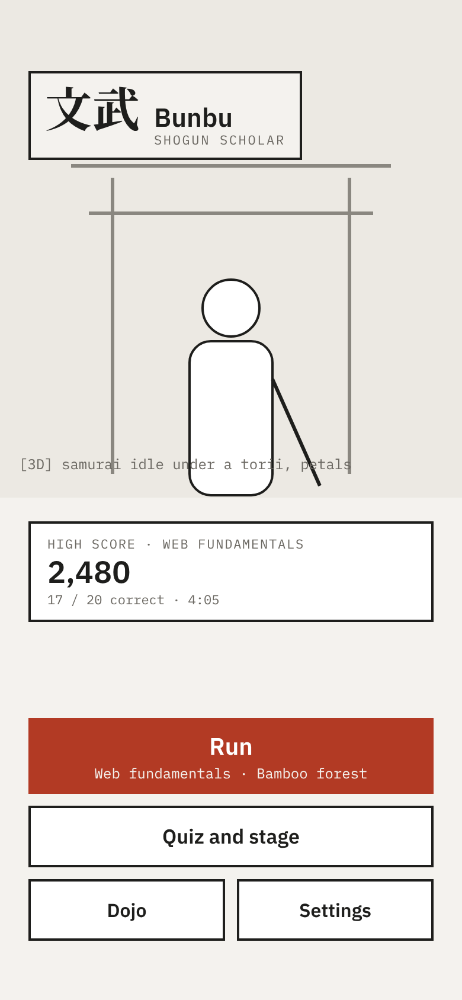

- 3D samurai idling under a torii, falling petals.
- 文武 · **Bunbu** · Shogun Scholar.
- The chosen quiz: its title, and its high score `2,480` with `17 / 20 correct · 4:05` (or "No high score yet"), and **Share**, which sends the quiz on as a `.bunbu` file ([sharing](data-format.md#sharing)): the share sheet where the browser says it takes the file (`navigator.canShare`). Otherwise a scroll explains how to share by hand, without saying why: a friend needs the quiz and Bunbu, so **Download the quiz**, **Share Bunbu** (a link to the game; copied where there is no share sheet), and they load the file under Quizzes. **Close** leaves it.
- **Fight**, **Change quiz**, **Dojo**, **Settings**. Without a chosen quiz: **Fight** ("Choose a quiz first") and **Quizzes** both lead to Quizzes.

### 1b Quizzes

A screen of its own, so the title stays calm:

- An area to drop a `.yaml` or `.bunbu` file on, or tap to choose one.
- Why a file didn't load (by line), and which questions of the chosen quiz won't fit in a fight.
- The loaded quizzes as cards, one under the other, with title, `version`, pass mark and best score (`v3 · pass 70% · best 2,480`, or `new`). Tapping one chooses it.

### 2 Fight setup

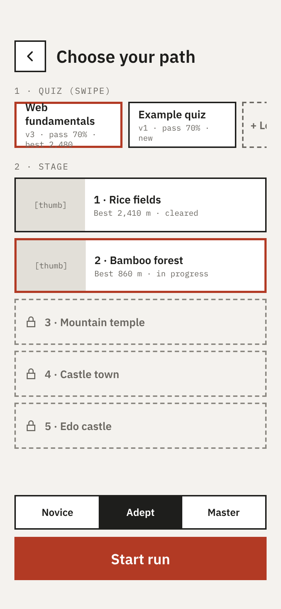

"Choose your path". The quiz is chosen on Quizzes (1b); the stage and the difficulty only matter to a fight, so they are chosen here:

1. **Quiz:** the chosen quiz, and which of its questions won't fit in a fight.
2. **Stage:** Rice fields, Bamboo forest, Mountain temple, Castle town, Edo castle. Each shows its best distance and whether it was cleared.

A Novice / Adept / Master selector (sets `timeScale`, see [time limit](gameplay.md#time-limit)) and **Start run**.

### 3 Running

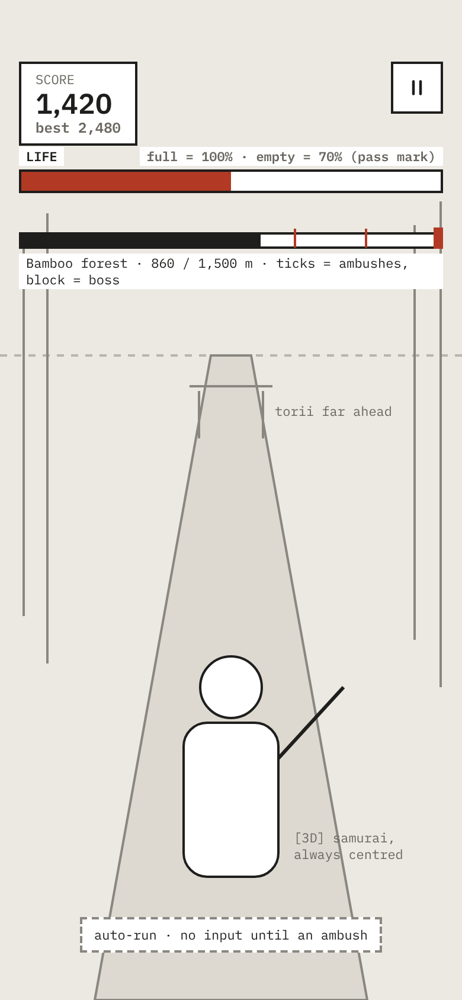

- 3D samurai, always centred, auto-running toward a torii. No input until an ambush.
- HUD: **score** with best to beat, **life bar** (full = 100%, empty = the pass mark), and a **pause** button.
- Progress bar: stage name and distance (`860 / 1,500 m`). Ticks mark ambushes, a block marks the boss.

### 4 Ambush

All variants: the scroll down to the bottom of the screen, with the swipe zone as its footer: a brush-lettered line on how to answer, the marks swiped so far as small arrows, then a ruled paper-cutting target of the scroll's own paper, edge to edge down to the rod between grey strips, which shows the finger's trace and a red slash for the last pick, slow motion, no timer bar. See [ambush](gameplay.md#ambush).

The scroll's heading is the label, the question type, `2 OF 3` for the rounds of `solutions` and `match`, `CHOOSE n` for `multiple`, and the ninjas (`7 OPTIONS · 5 NINJAS` when some carry two). `yes-no` is always one ninja and doesn't say so.

- **4A single:** `AMBUSH · SINGLE · 3 NINJAS`, options on ← ↑ →, "swipe toward your answer".
- **4B solutions / yes-no:** `AMBUSH · SOLUTIONS · 2 OF 3`, scenario on the scroll, one ninja, ↑ yes (slash) / ↓ no (block).
- **4C multiple / order:** `AMBUSH · MULTIPLE · CHOOSE 2`. Marked options show `MARKED`. Hint: "swipe each answer · lift + pause = strike". A swipe is final: swiping a marked option again does nothing. For `order` the marks get numbers in swipe order.
- **4D many options:** `AMBUSH · 7 OPTIONS · 5 NINJAS`. Each option lists its mark; which ninja carries it isn't shown. 8 directions; front 3 strike in wave 1, back 2 in wave 2.

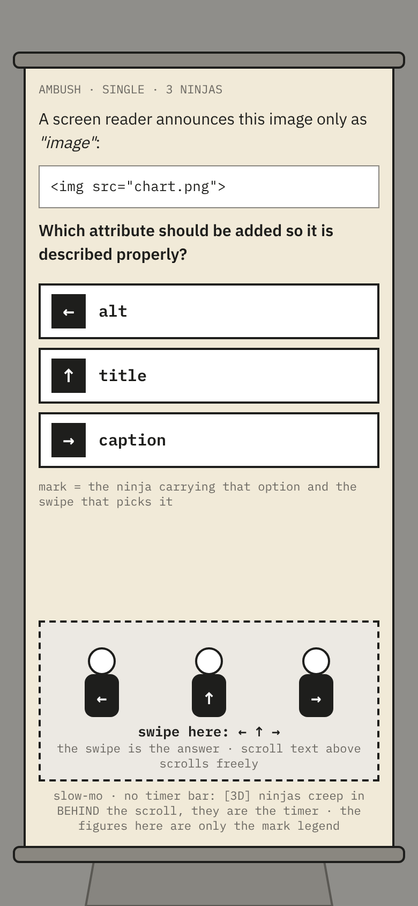 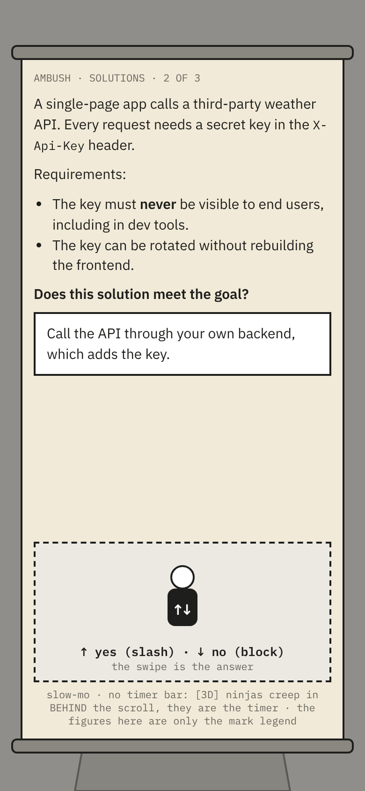 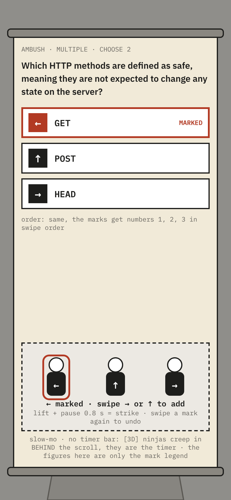 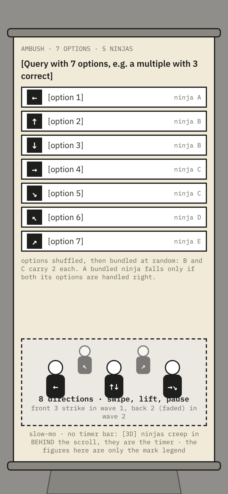

### 5 Outcome

- **5A Correct:** `+100`. The scroll rolls up, slow motion snaps back. Picked ninjas slain, the others blocked and fleeing.
- **5B Wrong:** score `+0`, the lost chunk of the life bar flashes and drops off, red edge flash, haptic buzz (can be turned off in settings). A ninja lands the hit, all vanish. About 1 s, then the run resumes.
- **5C Unanswered:** time ran out. The front ninja slices through the scroll, then all hit (one hit). The halves of the scroll fall away and the run resumes.

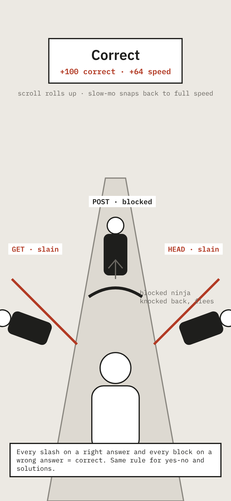 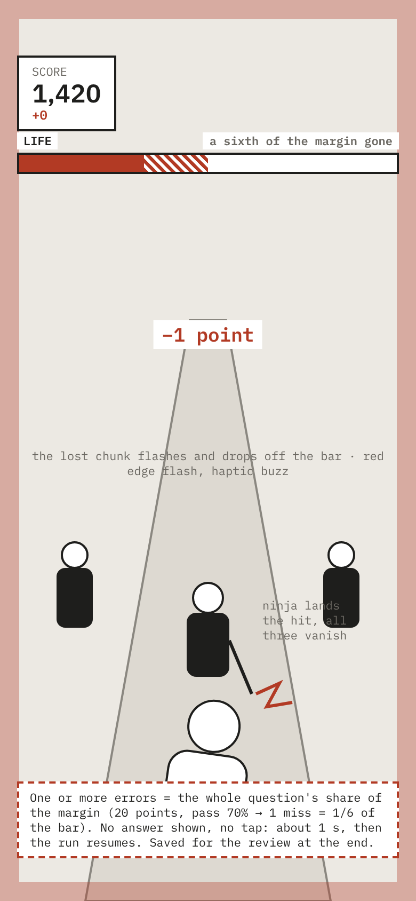 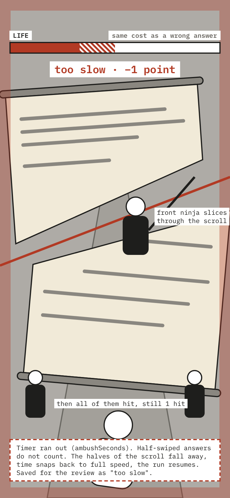

### 6 Pause

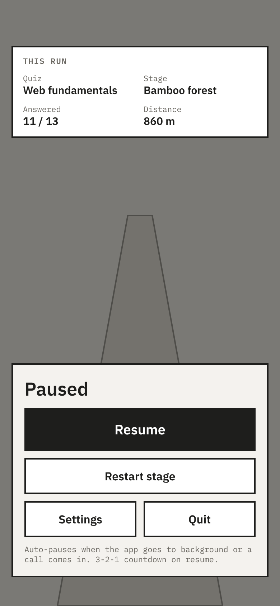

All on a scroll over the dimmed world, like an ambush:

- This run: quiz, stage, answered (`11 / 13`), distance.
- **Resume**, **Restart stage**, **Settings**, **Quit** at the foot of the scroll. Settings open in place on the scroll; the difficulty only shows there, since it can't change halfway through a run.
- Auto-pauses when the app goes to the background or a call comes in. 3-2-1 countdown on resume.
- Also pauses on **Back** and when the player leaves full screen. On a phone a run (and practice) plays full screen; resuming goes full screen again, and **Back** while paused leaves the run.

### 7 Finished: results and mistakes

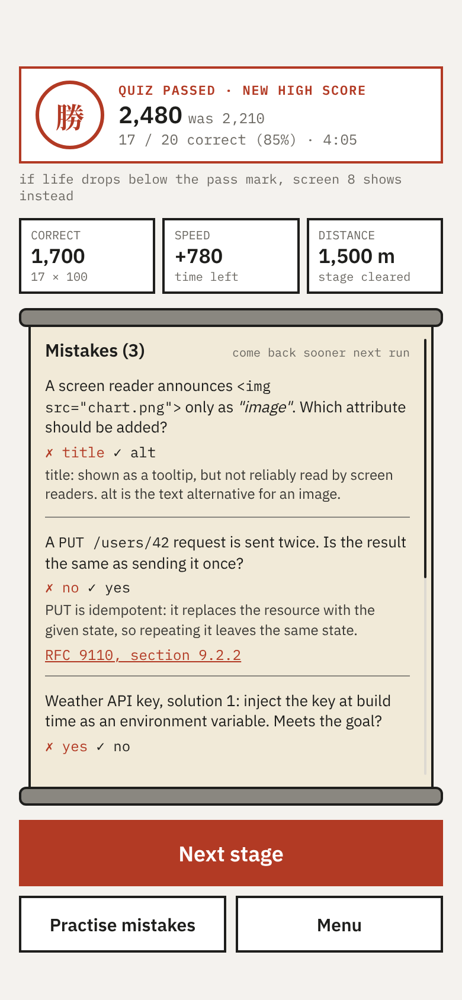

One scroll over the world holds all of it; the buttons stay at its foot while the rest scrolls.

- 勝 · `QUIZ PASSED · NEW HIGH SCORE` · score, with the previous best (`was 2,210`).
- `17 / 20 correct (85%) · 4:05`.
- Breakdown: **Correct** (`17 × 100`), **Time** (tiebreak for the high score), **Distance** (stage cleared).
- **Mistakes**: each miss with ✗ your pick, ✓ the right answer, the explanation and references.
- **Next stage**, **Practise mistakes**, **Menu**.

### 8 Fallen

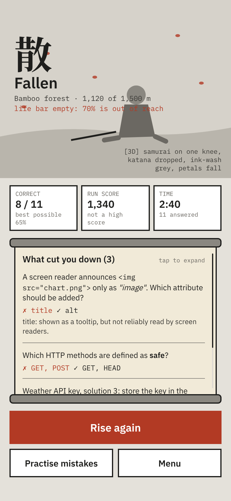

Shown instead of 7 when the life bar is empty, on the same kind of scroll.

- 散 · **Fallen** · stage and distance reached (`1,120 of 1,500 m`) · "life bar empty: 70% is out of reach".
- 3D samurai on one knee, katana dropped, ink-wash grey, petals falling.
- Correct (`8 / 11`, best possible 65%), **run score** (marked "not a high score"), time.
- "What cut you down": the mistakes, tap to expand.
- **Rise again**, **Practise mistakes**, **Menu**.

## Dojo

See [dojo.md](dojo.md) for the rules.

### D1 Dojo menu

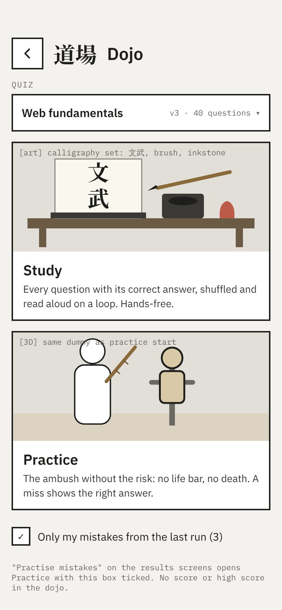

- 道場 · **Dojo** · quiz picker (`v3 · 40 questions`).
- **Study** card, with calligraphy-set art (文武, brush, inkstone).
- **Practice** card, with the training dummy from D3.
- Checkbox **Only my mistakes from the last run (3)**.

### D2 Study

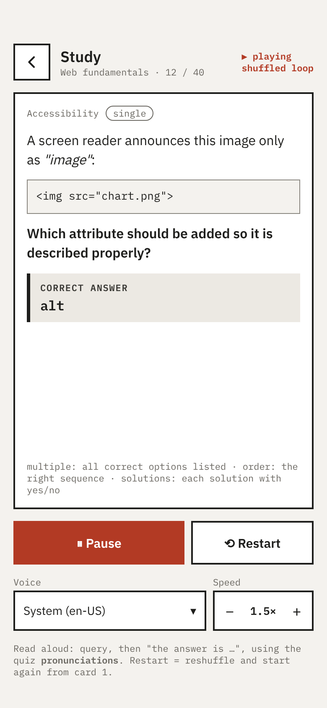

- Progress (`12 / 40`), `▶ playing · shuffled loop`.
- The word being spoken is highlighted: grey background and underline.
- Card: category, type, query, and **Correct answer**. `multiple` lists all correct options, `order` the right sequence, `solutions` each solution with yes/no.
- **Pause**, **Restart**, **Voice** (`System (en-US)`), **Speed** (`− 1.5× +`).

### D3 Practice start

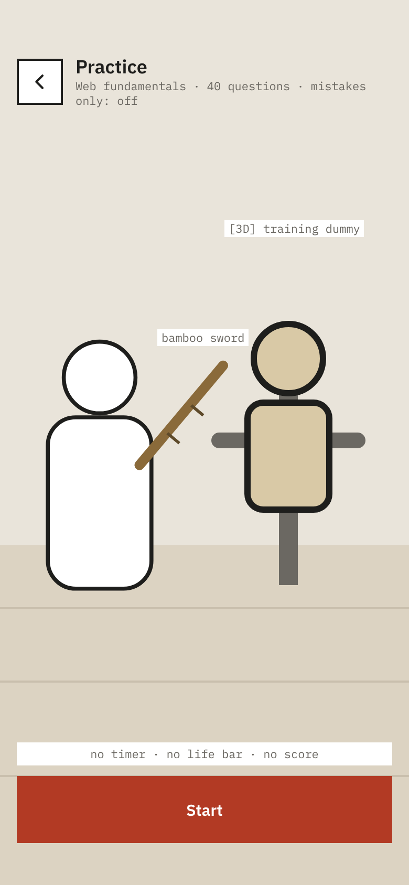

- Quiz, question count, "mistakes only: off".
- 3D training dummy holding a bamboo sword. "no timer · no life bar · no score".
- **Start**.

### D4 Practice ambush

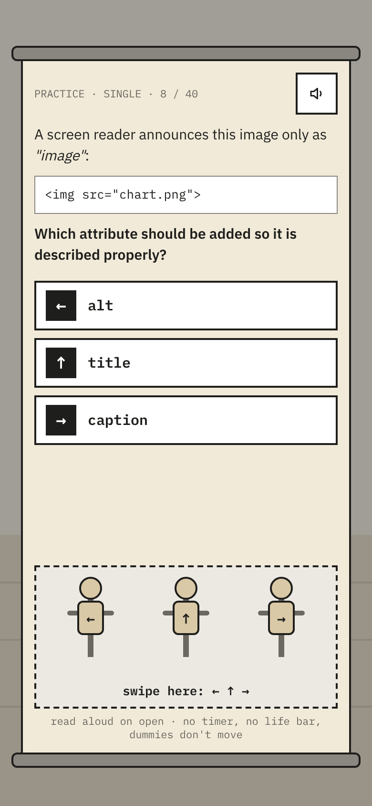

Like 4A, with `PRACTICE · SINGLE · 8 / 40` and the running right vs wrong percentage. A speaker button reads the card aloud. No timer, no life bar, the dummies don't move.

### D5 Practice miss

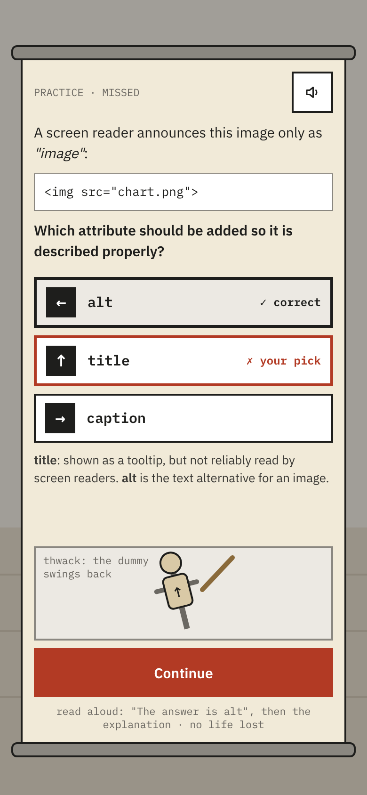

- `PRACTICE · MISSED`. The options show ✓ correct and ✗ your pick, followed by the explanation.
- The dummy swings back: thwack.
- Speaker button reads "The answer is alt", then the explanation. No life lost.
- **Continue**.

## Notes

- **Novice / Adept / Master** on screen 2 maps to `timeScale` (exact values to tune in playtests).
